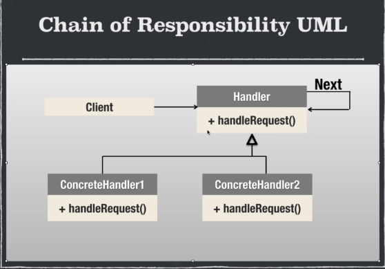

# Chain of responsability

## Ventajas

- Reduce el grado de acoplamiento
- El objeto no necesita conocer la estructura de la cadena
- Se puede cambiar el orden de la cadena
- flexibilidad al asignar responsabilidades a las clases