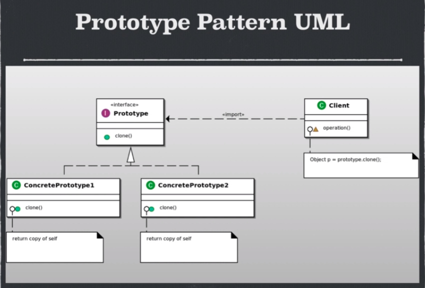

# Prototype

## Ventajas

- Si el costo de crear un objeto conlleva demasiado lo mejor es clonarlo.
- Nos oculta la conplejidad de crear los objetos.
- Podemos agregar y elimininar los objetos en tiempo de ejecucion.
