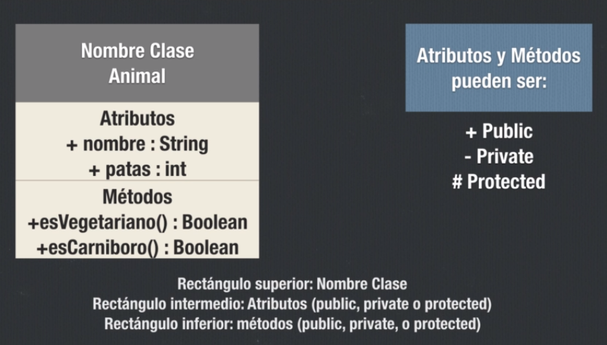
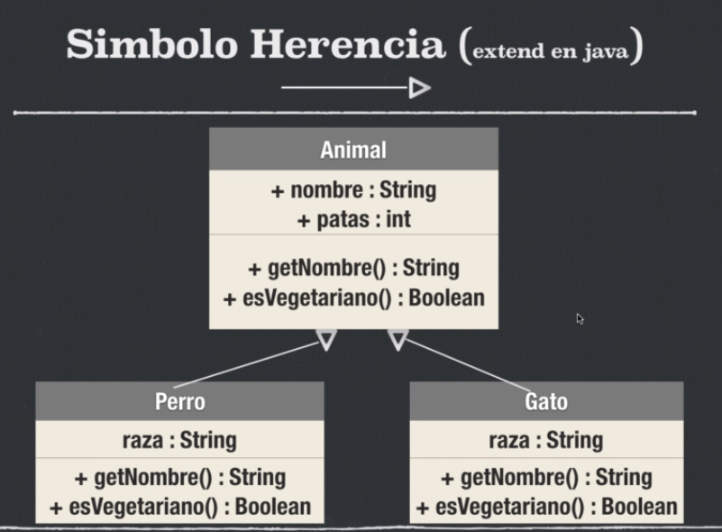
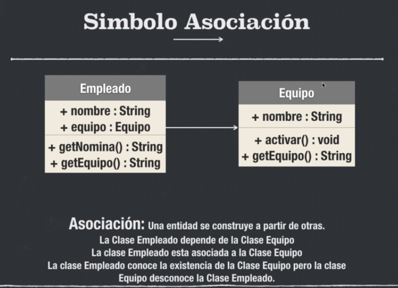
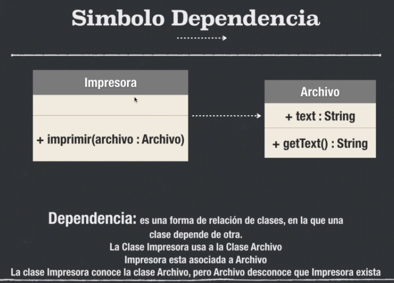
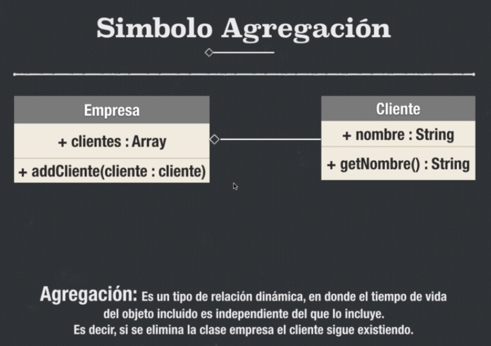
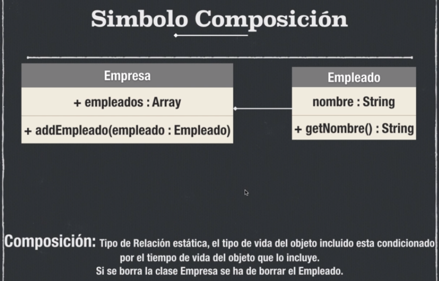

# UML

- [Diagrama de clases](#Diagrama-de-clases)
- [Simbolo Herencia](#Simbolo-Herencia)
- [Simbolo Asociacion](#Simbolo-Asociacion)
- [Simbolo Dependencia](#Simbolo-Dependencia)
- [Simbolo Agregacion](#Simbolo-Agregacion)
- [Simbolo Composicion](#Simbolo-Composicion)

## Diagrama de clases

## Simbolo Herencia

## Simbolo Asociacion

La clase Empleado conoce a la clase Equipo, pero la clase Equipo desconoce a la clase Empleado. La clase Equipo esta como atributo.

## Simbolo Dependencia

La clase Impresora conoce a la clase Archivo, sin embargo la clase Archivo desconoce la clase Impresora. La clase Archivo se presenta en el metodo no en atributos.

## Simbolo Agregacion

Si se elimina la clase empresa el cliente sigue existiendo.

## Simbolo Composicion

Si borramos la clase Empresa la clase Empleado tambien se elimina.
